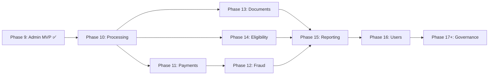
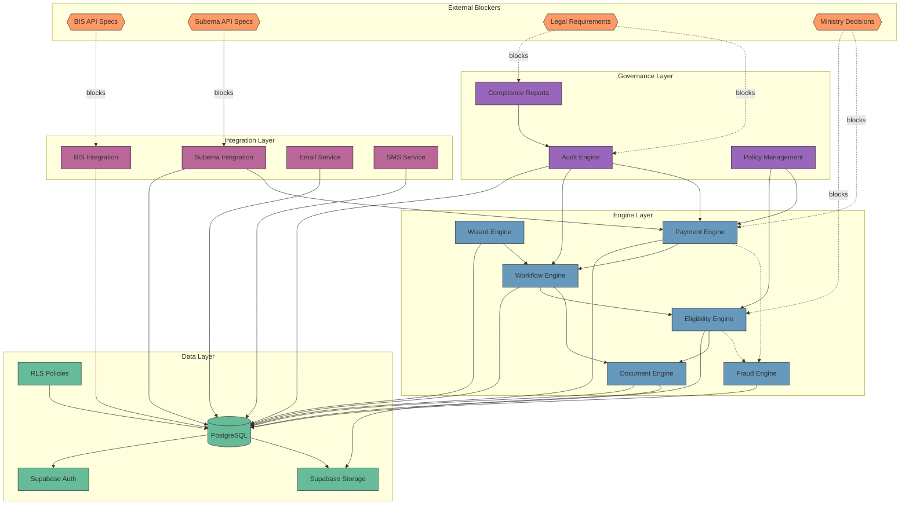

# SoZaVo Platform v1.0 – System Architecture

> **Version:** 3.9 (Phase 10 Step 2 Complete)  
> **Status:** Authoritative Reference Document  
> **Source:** Synthesized from sozavo_technical_architecture_v_2_en.md, workflow_blueprint_v2, and Phase Documents  
> **Cross-References:** PRD.md, Data-Dictionary.md, Tasks.md, Backend.md, Admin-MVP-Scope.md

---

## Phase Progression Map



### Phase 9 Admin MVP – COMPLETE ✅

Phase 9 implements **8 case-centric modules** as the foundation for all subsequent phases:

| ID | Module | Architecture | Status |
|----|--------|--------------|--------|
| 2.1 | Authentication & Role Shell | Supabase Auth + RLS + Role Context | ✅ Complete |
| 2.2 | Case Search & Overview | Read-only query layer + filters | ✅ Complete |
| 2.3 | Case Detail & Timeline View | Case header + info panels + events | ✅ Complete |
| 2.4 | Eligibility Panel (case-level) | Panel A within Case Detail | ✅ Complete |
| 2.5 | Documents Panel (case-level) | Panel B within Case Detail | ✅ Complete |
| 2.6 | Payments Panel (case-level) | Panel C within Case Detail | ✅ Complete |
| 2.7 | Fraud & Risk Panel (case-level) | Panel D within Case Detail | ✅ Complete |
| 2.8 | Configuration (read-only) | Standalone config overview | ✅ Complete |

### Case-Centric Architecture Principle

**MVP Boundary**: All eligibility, documents, payments, and fraud views are **panels within Case Detail**, not standalone pages. This reflects the case-centric processing model where cases are the primary unit of work.

**Post-MVP Expansion**: Standalone pages (Eligibility Dashboard, Documents Manager, Payments & Batches, Fraud Investigations) are Phase 10+ features that build upon the case-centric foundation.

### Phase 10+ Roadmap

| Phase | Focus | Architectural Additions |
|-------|-------|------------------------|
| Phase 10 | Processing Modules | Standalone intake/review pages, workflow mutations |
| Phase 11 | Payments & Batches | Payment execution engine, Subema sync, batch management |
| Phase 12 | Fraud & Investigations | Fraud investigation workflows, signal escalation |
| Phase 13 | Documents & Verification | Document verification actions, storage integration |
| Phase 14 | Eligibility Review Dashboard | Override capabilities, rule management |
| Phase 15 | Reporting & Analytics | Dashboard analytics, KPIs, exports |
| Phase 16 | User Management | User CRUD, role assignment, office management |
| Phase 17+ | Governance, Audit, Scaling | Audit trails, compliance, performance |

---

## Phase 9D-2F – Configuration UI Architecture

### Component Architecture

```
┌─────────────────────────────────────────────────────────────────────────────┐
│                    CONFIGURATION UI MODULE (Phase 9D-2F)                     │
├─────────────────────────────────────────────────────────────────────────────┤
│                                                                              │
│   QUERY LAYER (src/integrations/supabase/queries/config.ts)                 │
│   ┌──────────────────────────────────────────────────────────────────────┐  │
│   │ getServiceTypes(limit)                                                │  │
│   │   → service_types.select().order('code').limit(20)                   │  │
│   │                                                                       │  │
│   │ getOffices(limit)                                                     │  │
│   │   → offices.select().order('district_id', 'name').limit(20)          │  │
│   │                                                                       │  │
│   │ getWorkflowDefinitions(limit)                                         │  │
│   │   → workflow_definitions.select('*, service_types(code,name)')       │  │
│   │     .order('service_type_id', 'from_status').limit(20)               │  │
│   │                                                                       │  │
│   │ getEligibilityRules(limit)                                            │  │
│   │   → eligibility_rules.select('*, service_types(code,name)')          │  │
│   │     .order('service_type_id', 'priority').limit(20)                  │  │
│   │                                                                       │  │
│   │ + Count functions for each table (for summary cards)                  │  │
│   └──────────────────────────────────────────────────────────────────────┘  │
│                                                                              │
│   COMPONENTS                                                                 │
│   ┌──────────────────────────────────────────────────────────────────────┐  │
│   │ ConfigurationIndex (src/pages/admin/configuration/Index.tsx)         │  │
│   │   ├── Loading skeleton (placeholder-glow)                            │  │
│   │   ├── Error alert (alert-danger)                                     │  │
│   │   ├── Summary Cards Row:                                             │  │
│   │   │   ├── Service Types (active count)                               │  │
│   │   │   ├── Offices (active count)                                     │  │
│   │   │   ├── Workflow Transitions (total count)                         │  │
│   │   │   └── Eligibility Rules (total count)                            │  │
│   │   ├── Service Types Table (code, name, description, status badge)    │  │
│   │   ├── Offices Table (name, district, address, phone, status badge)   │  │
│   │   ├── Workflow Transitions Table (service, from→to, role, status)    │  │
│   │   └── Eligibility Rules Table (service, name, type, priority, etc.)  │  │
│   └──────────────────────────────────────────────────────────────────────┘  │
│                                                                              │
│   READ-ONLY: No mutations, no CRUD, max 20 rows per table                   │
│                                                                              │
└─────────────────────────────────────────────────────────────────────────────┘
```

### Data Flow Diagram

```
┌─────────────────────────────────────────────────────────────────────────────┐
│                      CONFIGURATION UI DATA FLOW                              │
├─────────────────────────────────────────────────────────────────────────────┤
│                                                                              │
│   ┌───────────────────┐                                                      │
│   │ ConfigurationIndex│                                                      │
│   │   (useEffect)     │ ─── Promise.all (8 parallel queries):                │
│   └─────────┬─────────┘                                                      │
│             │                                                                │
│             ▼ RLS: authenticated = true (all staff roles can read)          │
│                                                                              │
│   ┌──────────────────────┐  ┌──────────────────────┐                        │
│   │   service_types      │  │      offices         │                        │
│   │   (code, name, ...)  │  │   (name, district)   │                        │
│   └──────────┬───────────┘  └──────────┬───────────┘                        │
│              │                          │                                    │
│   ┌──────────┴──────────────────────────┴───────────┐                       │
│   │                                                  │                       │
│   │   workflow_definitions ←─┐   eligibility_rules ←─┤                      │
│   │   (from_status, to_...)  │   (rule_name, ...)    │                      │
│   │                          │                        │                      │
│   │       JOIN: service_types (code, name)           │                      │
│   └──────────────────────────┴───────────────────────┘                      │
│              │                                                               │
│              ▼                                                               │
│   ┌─────────────────────────────────────────────────────────────┐           │
│   │                    ConfigurationIndex                        │           │
│   │   State: serviceTypes, offices, workflows, rules, counts    │           │
│   │       │                                                      │           │
│   │       ▼                                                      │           │
│   │   Summary Cards + 4 Read-Only Tables with Badges            │           │
│   └─────────────────────────────────────────────────────────────┘           │
│                                                                              │
└─────────────────────────────────────────────────────────────────────────────┘
```

---

## Phase 9D-2E – Fraud & Risk UI Architecture

### Component Architecture

```
┌─────────────────────────────────────────────────────────────────────────────┐
│                      FRAUD & RISK UI MODULE (Phase 9D-2E)                    │
├─────────────────────────────────────────────────────────────────────────────┤
│                                                                              │
│   QUERY LAYER (src/integrations/supabase/queries/fraud.ts)                  │
│   ┌──────────────────────────────────────────────────────────────────────┐  │
│   │ getFraudSignalsByCase(caseId)                                         │  │
│   │   → fraud_signals.select().eq('case_id').order('created_at', desc)   │  │
│   │   → Returns: CaseFraudSignal[]                                        │  │
│   │                                                                       │  │
│   │ getFraudRiskScoreByCase(caseId)                                       │  │
│   │   → fraud_risk_scores.select().eq('case_id').maybeSingle()           │  │
│   │   → Returns: CaseFraudRiskScore | null                                │  │
│   └──────────────────────────────────────────────────────────────────────┘  │
│                                                                              │
│   COMPONENTS                                                                 │
│   ┌──────────────────────────────────────────────────────────────────────┐  │
│   │ CaseFraudPanel (replaces CaseFraudPlaceholder)                       │  │
│   │   ├── Loading skeleton (placeholder-glow)                            │  │
│   │   ├── Error alert (alert-danger)                                     │  │
│   │   ├── Empty state ("No fraud signals recorded")                      │  │
│   │   ├── Risk Summary Block:                                            │  │
│   │   │   ├── Risk Score (0-100, 1 decimal)                              │  │
│   │   │   ├── Risk Level badge (minimal/low/medium/high/critical)        │  │
│   │   │   ├── Signal Count                                               │  │
│   │   │   └── Last Evaluated datetime                                    │  │
│   │   └── Signals Table:                                                 │  │
│   │       ├── Signal Type (formatted snake_case → Title Case)            │  │
│   │       ├── Severity badge (low/medium/high/critical)                  │  │
│   │       ├── Status badge (pending/investigating/confirmed/dismissed)   │  │
│   │       ├── Description (truncated with tooltip)                       │  │
│   │       └── Detected At datetime                                       │  │
│   └──────────────────────────────────────────────────────────────────────┘  │
│                                                                              │
│   ⚠️ TESTING NOTE: Full evidence and description exposed for Phase 9.       │
│      Must be role-scoped and redacted before production (Phase 10+).        │
│                                                                              │
└─────────────────────────────────────────────────────────────────────────────┘
```

### Data Flow Diagram

```
┌─────────────────────────────────────────────────────────────────────────────┐
│                        FRAUD & RISK UI DATA FLOW                             │
├─────────────────────────────────────────────────────────────────────────────┤
│                                                                              │
│   ┌───────────────────┐                                                      │
│   │  CaseDetailPage   │                                                      │
│   │  (useEffect #5)   │ ─── Parallel fetch:                                 │
│   └─────────┬─────────┘     getFraudSignalsByCase(id)                        │
│             │               getFraudRiskScoreByCase(id)                      │
│             │                                                                │
│             ▼ RLS: is_admin() OR is_fraud_officer() OR is_department_head() │
│   ┌─────────────────────────────────────────────────────────────┐           │
│   │                    fraud_signals table                       │           │
│   │   → signal_type, severity, status, description, evidence    │           │
│   └─────────────────────────────────────────────────────────────┘           │
│   ┌─────────────────────────────────────────────────────────────┐           │
│   │                    fraud_risk_scores table                   │           │
│   │   → risk_score, risk_level, signal_count, last_evaluated_at │           │
│   └─────────────────────────────────────────────────────────────┘           │
│             │                                                                │
│             ▼                                                                │
│   ┌─────────────────────────────────────────────────────────────┐           │
│   │                    CaseFraudPanel                            │           │
│   │   signals={...}  riskScore={...}  isLoading  error           │           │
│   │       │                                                      │           │
│   │       ▼                                                      │           │
│   │   Risk Summary + Signals Table with Badges                   │           │
│   └─────────────────────────────────────────────────────────────┘           │
│                                                                              │
└─────────────────────────────────────────────────────────────────────────────┘
```

---

## Phase 9D-2D – Payments UI Architecture

### Component Architecture

```
┌─────────────────────────────────────────────────────────────────────────────┐
│                       PAYMENTS UI MODULE (Phase 9D-2D)                       │
├─────────────────────────────────────────────────────────────────────────────┤
│                                                                              │
│   QUERY LAYER (src/integrations/supabase/queries/payments.ts)               │
│   ┌──────────────────────────────────────────────────────────────────────┐  │
│   │ getCasePayments(caseId)                                               │  │
│   │   → payments.select().eq('case_id').order('payment_date', desc)      │  │
│   │   → Returns: CasePayment[]                                           │  │
│   └──────────────────────────────────────────────────────────────────────┘  │
│                                                                              │
│   COMPONENTS                                                                 │
│   ┌──────────────────────────────────────────────────────────────────────┐  │
│   │ CasePaymentsPanel (replaces CasePaymentsPlaceholder)                 │  │
│   │   ├── Loading skeleton (placeholder-glow)                            │  │
│   │   ├── Error alert (alert-danger)                                     │  │
│   │   ├── Empty state ("No payments recorded")                           │  │
│   │   └── Payments table:                                                │  │
│   │       ├── Payment Date (formatted)                                   │  │
│   │       ├── Amount (SRD currency format)                               │  │
│   │       ├── Method (human-readable label)                              │  │
│   │       ├── Status badge (pending/processed/failed/cancelled)          │  │
│   │       └── Reference (Subema ref or "—")                              │  │
│   └──────────────────────────────────────────────────────────────────────┘  │
│                                                                              │
└─────────────────────────────────────────────────────────────────────────────┘
```

### Data Flow Diagram

```
┌─────────────────────────────────────────────────────────────────────────────┐
│                        PAYMENTS UI DATA FLOW                                 │
├─────────────────────────────────────────────────────────────────────────────┤
│                                                                              │
│   ┌───────────────────┐                                                      │
│   │  CaseDetailPage   │                                                      │
│   │  (useEffect #1)   │ ─── getCaseById(id) ───▶ caseData                    │
│   └─────────┬─────────┘                                                      │
│             │                                                                │
│             │ caseData loaded (triggers useEffect #4)                        │
│             ▼                                                                │
│   ┌───────────────────┐                                                      │
│   │  CaseDetailPage   │                                                      │
│   │  (useEffect #4)   │ ─── getCasePayments(id)                              │
│   └─────────┬─────────┘                                                      │
│             │                                                                │
│             ▼ RLS: has_case_access(case_id)                                  │
│   ┌─────────────────────────────────────────────────────────────┐           │
│   │                    payments table                            │           │
│   │   → amount, payment_date, status, payment_method, ...       │           │
│   └─────────────────────────────────────────────────────────────┘           │
│             │                                                                │
│             ▼                                                                │
│   ┌─────────────────────────────────────────────────────────────┐           │
│   │                    CasePaymentsPanel                         │           │
│   │   payments={...}  isLoading  error                           │           │
│   │       │                                                      │           │
│   │       ▼                                                      │           │
│   │   Formatted Table with Status Badges                         │           │
│   └─────────────────────────────────────────────────────────────┘           │
│                                                                              │
└─────────────────────────────────────────────────────────────────────────────┘
```

---

## Phase 9D-2B – Eligibility UI Architecture

### Component Architecture

```
┌─────────────────────────────────────────────────────────────────────────────┐
│                       ELIGIBILITY UI MODULE (Phase 9D-2B)                    │
├─────────────────────────────────────────────────────────────────────────────┤
│                                                                              │
│   QUERY LAYER (src/integrations/supabase/queries/eligibility.ts)            │
│   ┌──────────────────────────────────────────────────────────────────────┐  │
│   │ getEligibilitySummary(caseId)                                         │  │
│   │   → eligibility_evaluations.select().eq('case_id').maybeSingle()     │  │
│   │   → Returns: EligibilityEvaluation | null                            │  │
│   │                                                                       │  │
│   │ getEligibilityRulesForService(serviceTypeId)                          │  │
│   │   → eligibility_rules.select().eq('service_type_id').eq('is_active') │  │
│   │   → Returns: EligibilityRule[]                                        │  │
│   └──────────────────────────────────────────────────────────────────────┘  │
│                                                                              │
│   COMPONENTS                                                                 │
│   ┌──────────────────────────────────────────────────────────────────────┐  │
│   │ EligibilityResultBadge                                                │  │
│   │   → Maps result string to DarkoneBadge variant                       │  │
│   │   → ELIGIBLE/approved → success (soft)                               │  │
│   │   → INELIGIBLE/rejected → danger (soft)                              │  │
│   │   → pending/null → secondary (soft)                                  │  │
│   └──────────────────────────────────────────────────────────────────────┘  │
│                                                                              │
│   ┌──────────────────────────────────────────────────────────────────────┐  │
│   │ CaseEligibilityPanel (replaces CaseEligibilityPlaceholder)           │  │
│   │   ├── Loading skeleton (placeholder-glow)                            │  │
│   │   ├── Error alert (alert-danger)                                     │  │
│   │   ├── Empty state ("No evaluation available")                        │  │
│   │   └── Evaluation display:                                            │  │
│   │       ├── Result badge + Evaluated At                                │  │
│   │       ├── Override info (alert-info, if override_reason exists)      │  │
│   │       └── Criteria Results Table:                                    │  │
│   │           ├── Rule Name (matched from rules or formatted key)        │  │
│   │           ├── Mandatory (Yes/No badge or —)                          │  │
│   │           └── Result (Pass/Fail badge)                               │  │
│   └──────────────────────────────────────────────────────────────────────┘  │
│                                                                              │
└─────────────────────────────────────────────────────────────────────────────┘
```

### Data Flow Diagram

```
┌─────────────────────────────────────────────────────────────────────────────┐
│                       ELIGIBILITY UI DATA FLOW                               │
├─────────────────────────────────────────────────────────────────────────────┤
│                                                                              │
│   ┌───────────────────┐                                                      │
│   │  CaseDetailPage   │                                                      │
│   │  (useEffect #1)   │ ─── getCaseById(id) ───▶ caseData                    │
│   └─────────┬─────────┘                                                      │
│             │                                                                │
│             │ caseData loaded (triggers useEffect #3)                        │
│             ▼                                                                │
│   ┌───────────────────┐                                                      │
│   │  CaseDetailPage   │                                                      │
│   │  (useEffect #3)   │                                                      │
│   └─────────┬─────────┘                                                      │
│             │                                                                │
│             ├── getEligibilitySummary(id)                                    │
│             │         │                                                      │
│             │         ▼ RLS: has_case_access(case_id)                        │
│             │   ┌─────────────────────────────────────┐                      │
│             │   │   eligibility_evaluations table     │                      │
│             │   │   → result, criteria_results, ...   │                      │
│             │   └─────────────────────────────────────┘                      │
│             │                                                                │
│             └── getEligibilityRulesForService(service_type_id)               │
│                       │                                                      │
│                       ▼ RLS: authenticated read access                       │
│                 ┌─────────────────────────────────────┐                      │
│                 │     eligibility_rules table         │                      │
│                 │     → rule_name, is_mandatory, ...  │                      │
│                 └─────────────────────────────────────┘                      │
│                                                                              │
│             │                         │                                      │
│             ▼                         ▼                                      │
│   ┌─────────────────────────────────────────────────────────────┐           │
│   │                    CaseEligibilityPanel                      │           │
│   │   evaluation={...}  rules={...}  isLoading  error            │           │
│   │       │                 │                                    │           │
│   │       ▼                 ▼                                    │           │
│   │   EligibilityResultBadge   Criteria Results Table            │           │
│   └─────────────────────────────────────────────────────────────┘           │
│                                                                              │
└─────────────────────────────────────────────────────────────────────────────┘
```

---

## Phase 9D-2A – Cases UI Architecture

### Component Architecture

```
┌─────────────────────────────────────────────────────────────────────────────┐
│                         CASES UI MODULE (Phase 9D-2A)                        │
├─────────────────────────────────────────────────────────────────────────────┤
│                                                                              │
│   PAGES                                                                      │
│   ┌──────────────────────────────────────────────────────────────────────┐  │
│   │ CasesIndexPage (/admin/cases)                                        │  │
│   │   ├── PageTitle                                                       │  │
│   │   ├── DarkoneCard                                                     │  │
│   │   │   ├── CaseFilters (search, status, service, office)              │  │
│   │   │   ├── CaseListTable                                               │  │
│   │   │   │   └── CaseStatusBadge (per row)                              │  │
│   │   │   └── Pagination Controls                                         │  │
│   │   └── State: page, filters, data, isLoading, error                   │  │
│   └──────────────────────────────────────────────────────────────────────┘  │
│                                                                              │
│   ┌──────────────────────────────────────────────────────────────────────┐  │
│   │ CaseDetailPage (/admin/cases/:id)                                    │  │
│   │   ├── PageTitle                                                       │  │
│   │   ├── CaseDetailHeader (reference, status, citizen, service, back)   │  │
│   │   ├── Row                                                             │  │
│   │   │   ├── Col-6: CaseInfoPanel, CitizenInfoPanel, ServiceInfoPanel   │  │
│   │   │   └── Col-6: CaseTimeline, Placeholders (4)                      │  │
│   │   └── State: caseData, timelineEvents, loading states, errors        │  │
│   └──────────────────────────────────────────────────────────────────────┘  │
│                                                                              │
├─────────────────────────────────────────────────────────────────────────────┤
│   COMPONENTS                                                                 │
│   ├── CaseStatusBadge     → Maps case_status enum to DarkoneBadge          │
│   ├── CaseFilters         → Search + dropdowns using Darkone form classes  │
│   ├── CaseListTable       → Uses DarkoneTable, handles loading skeleton    │
│   ├── CaseDetailHeader    → Back nav + title + status badge               │
│   ├── CaseInfoPanel       → Key-value table in DarkoneCard                 │
│   ├── CitizenInfoPanel    → Citizen details in DarkoneCard                 │
│   ├── ServiceInfoPanel    → Service type details in DarkoneCard            │
│   ├── CaseTimeline        → Vertical timeline with events                  │
│   └── Placeholders (4)    → Reserved for Eligibility/Docs/Payments/Fraud  │
│                                                                              │
└─────────────────────────────────────────────────────────────────────────────┘
```

### Data Flow Diagram

```
┌─────────────────────────────────────────────────────────────────────────────┐
│                         CASES UI DATA FLOW                                   │
├─────────────────────────────────────────────────────────────────────────────┤
│                                                                              │
│   ┌───────────────────┐                                                      │
│   │  CasesIndexPage   │                                                      │
│   │  (List View)      │                                                      │
│   └─────────┬─────────┘                                                      │
│             │ getCases({ page, pageSize, search, status, ... })              │
│             ▼                                                                │
│   ┌─────────────────────────────────────────────────────────────┐           │
│   │              Query Layer (cases.ts)                          │           │
│   │   getCases() → supabase.from('cases').select(...).range()   │           │
│   └─────────────────────────────────────────────────────────────┘           │
│             │                                                                │
│             ▼ RLS: has_case_access(id)                                       │
│   ┌─────────────────────────────────────────────────────────────┐           │
│   │                    Supabase (PostgreSQL)                     │           │
│   │   cases ← JOIN → citizens, service_types                    │           │
│   └─────────────────────────────────────────────────────────────┘           │
│             │                                                                │
│             ▼ { data: CaseWithRelations[], count, error }                    │
│   ┌─────────────────────────────────────────────────────────────┐           │
│   │              CaseListTable + Pagination                      │           │
│   └─────────────────────────────────────────────────────────────┘           │
│                                                                              │
│   ═══════════════════════════════════════════════════════════════           │
│                                                                              │
│   ┌───────────────────┐                                                      │
│   │  CaseDetailPage   │                                                      │
│   │  (Detail View)    │                                                      │
│   └─────────┬─────────┘                                                      │
│             │ getCaseById(id)         getCaseTimeline(id)                    │
│             ▼                         ▼                                      │
│   ┌─────────────────────────────────────────────────────────────┐           │
│   │              Query Layer (cases.ts)                          │           │
│   │   getCaseById() → .eq('id', id).maybeSingle()               │           │
│   │   getCaseTimeline() → .eq('case_id', id).order('desc')      │           │
│   └─────────────────────────────────────────────────────────────┘           │
│             │                         │                                      │
│             ▼ RLS applied             ▼ RLS applied                          │
│   ┌─────────────────────────────────────────────────────────────┐           │
│   │                    Supabase (PostgreSQL)                     │           │
│   │   cases ← JOIN → citizens, service_types, offices           │           │
│   │   case_events                                                │           │
│   └─────────────────────────────────────────────────────────────┘           │
│             │                         │                                      │
│             ▼                         ▼                                      │
│   ┌────────────────────┐    ┌────────────────────┐                          │
│   │ Info Panels:       │    │ CaseTimeline       │                          │
│   │ Case/Citizen/Svc   │    │ (events list)      │                          │
│   └────────────────────┘    └────────────────────┘                          │
│                                                                              │
└─────────────────────────────────────────────────────────────────────────────┘
```

---

## Phase 9D-1 Query Layer Architecture

### Cases Query Data Flow

```
┌─────────────────────────────────────────────────────────────────────────────┐
│                           QUERY LAYER (Phase 9D-1)                          │
├─────────────────────────────────────────────────────────────────────────────┤
│                                                                              │
│   CASES MODULE (src/integrations/supabase/queries/cases.ts)                 │
│                                                                              │
│   ┌──────────────────────────────────────────────────────────────────────┐  │
│   │                         getCases(params)                              │  │
│   │   • Paginated list with .range(start, end)                           │  │
│   │   • Joins: citizens(first_name, last_name), service_types(name)      │  │
│   │   • Filters: status, serviceTypeId, officeId, search                 │  │
│   │   • Returns: { data: CaseWithRelations[], count, error }             │  │
│   └──────────────────────────────────────────────────────────────────────┘  │
│                                     │                                        │
│   ┌──────────────────────────────────────────────────────────────────────┐  │
│   │                         getCaseById(caseId)                           │  │
│   │   • Full case with all fields                                         │  │
│   │   • Joins: citizens(*), service_types(name,desc,code), offices(name) │  │
│   │   • Uses .maybeSingle() for safe null handling                       │  │
│   │   • Returns: { data: CaseDetailWithRelations | null, error }         │  │
│   └──────────────────────────────────────────────────────────────────────┘  │
│                                     │                                        │
│   ┌──────────────────────────────────────────────────────────────────────┐  │
│   │                       getCaseTimeline(caseId)                         │  │
│   │   • All events for case from case_events                             │  │
│   │   • Ordered by created_at DESC                                       │  │
│   │   • Returns: { data: TimelineEvent[], error }                        │  │
│   └──────────────────────────────────────────────────────────────────────┘  │
│                                     │                                        │
│                                     ▼                                        │
│   ┌──────────────────────────────────────────────────────────────────────┐  │
│   │                    Supabase Client (authenticated)                    │  │
│   │   • Uses auth.uid() from session JWT                                 │  │
│   │   • RLS policies automatically applied                               │  │
│   │   • No service role key in frontend                                  │  │
│   └──────────────────────────────────────────────────────────────────────┘  │
│                                     │                                        │
│                                     ▼                                        │
│   ┌──────────────────────────────────────────────────────────────────────┐  │
│   │                       RLS POLICY ENFORCEMENT                          │  │
│   │   • has_case_access(case_id) for case-based tables                   │  │
│   │   • Role functions (is_admin, is_case_handler, etc.)                 │  │
│   │   • User-scoped for notifications                                    │  │
│   └──────────────────────────────────────────────────────────────────────┘  │
│                                                                              │
└─────────────────────────────────────────────────────────────────────────────┘
```

---

## Phase 9D-0 Database Layer

### Database Schema Overview

The complete database schema has been created following Data Dictionary v1.0 specifications:

```
┌─────────────────────────────────────────────────────────────────────────────┐
│                         DATABASE LAYER (PostgreSQL)                          │
├─────────────────────────────────────────────────────────────────────────────┤
│                                                                              │
│   ENUMS (9)                              SECURITY DEFINER FUNCTIONS (10+)   │
│   ├── case_status (10 values)            ├── has_role()                     │
│   ├── document_type (10 values)          ├── is_admin()                     │
│   ├── document_status (4 values)         ├── current_user_id()              │
│   ├── payment_status (4 values)          ├── get_user_internal_id()         │
│   ├── batch_status (8 values)            ├── has_case_access()              │
│   ├── payment_item_status (6 values)     ├── is_case_handler()              │
│   ├── fraud_severity (4 values)          ├── is_finance_officer()           │
│   ├── risk_level (5 values)              ├── is_fraud_officer()             │
│   └── audit_event_type (12 values)       └── ... (more role checks)         │
│                                                                              │
├─────────────────────────────────────────────────────────────────────────────┤
│                                                                              │
│   CORE TABLES (22)                                                           │
│   ┌─────────────────┐  ┌─────────────────┐  ┌─────────────────┐             │
│   │ service_types   │  │ offices         │  │ users           │             │
│   │ (3 seeded)      │  │ (3 seeded)      │  │ (internal staff)│             │
│   └─────────────────┘  └─────────────────┘  └─────────────────┘             │
│           │                    │                    │                        │
│           ▼                    ▼                    ▼                        │
│   ┌─────────────────────────────────────────────────────────────┐           │
│   │                         cases                                │           │
│   │ FK: citizen_id, service_type_id, intake_office_id,          │           │
│   │     case_handler_id, reviewer_id, intake_officer_id          │           │
│   └─────────────────────────────────────────────────────────────┘           │
│           │          │          │          │          │                      │
│           ▼          ▼          ▼          ▼          ▼                      │
│   ┌───────────┐ ┌──────────┐ ┌──────────┐ ┌──────────┐ ┌──────────┐        │
│   │case_events│ │documents │ │eligibility│ │payments  │ │fraud_    │        │
│   │           │ │          │ │evaluations│ │          │ │signals   │        │
│   └───────────┘ └──────────┘ └──────────┘ └──────────┘ └──────────┘        │
│                                    │              │          │               │
│                                    ▼              ▼          ▼               │
│                            ┌──────────┐  ┌──────────┐ ┌──────────┐          │
│                            │payment_  │  │payment_  │ │fraud_risk│          │
│                            │batches   │  │items     │ │scores    │          │
│                            └──────────┘  └──────────┘ └──────────┘          │
│                                                                              │
│   SUPPORTING TABLES:                                                         │
│   households, incomes, notifications, portal_notifications,                  │
│   subema_sync_logs, wizard_definitions, eligibility_rules,                   │
│   document_requirements, workflow_definitions                                │
│                                                                              │
├─────────────────────────────────────────────────────────────────────────────┤
│                                                                              │
│   ROW-LEVEL SECURITY (All 22 tables enabled)                                │
│   ├── Open (authenticated): service_types, offices, users, citizens...     │
│   ├── Case-based: cases, case_events, documents, eligibility_evaluations   │
│   ├── Role-restricted: payment_batches (finance), fraud_signals (fraud)    │
│   └── User-scoped: notifications (own), portal_notifications (own)         │
│                                                                              │
└─────────────────────────────────────────────────────────────────────────────┘
```

### Table Dependencies (Creation Order)

```
Level 0 (No Dependencies):
  ├── service_types
  └── offices

Level 1 (Depends on Level 0):
  ├── users (FK: offices)
  ├── citizens (FK: auth.users for portal_user_id)
  ├── eligibility_rules (FK: service_types)
  ├── document_requirements (FK: service_types)
  ├── workflow_definitions (FK: service_types)
  └── wizard_definitions (FK: service_types)

Level 2 (Depends on Level 1):
  ├── cases (FK: citizens, service_types, offices, users)
  ├── households (FK: citizens)
  └── payment_batches (FK: users)

Level 3 (Depends on Level 2):
  ├── case_events (FK: cases, users)
  ├── documents (FK: cases, citizens, users)
  ├── eligibility_evaluations (FK: cases, users)
  ├── payments (FK: cases, citizens)
  ├── fraud_signals (FK: cases, users)
  ├── fraud_risk_scores (FK: cases)
  ├── incomes (FK: citizens, cases, users)
  ├── notifications (FK: users, cases)
  └── portal_notifications (FK: citizens, cases)

Level 4 (Depends on Level 3):
  ├── payment_items (FK: payment_batches, payments, citizens)
  └── subema_sync_logs (FK: payments)
```

---

## 1. Architecture Overview

### 1.1 System Scope
SoZaVo Platform is a web-based social services management system consisting of:
- **Admin System:** Internal application for SoZaVo staff
- **Public Portal:** Citizen-facing application for self-service
- **Backend Services:** Database, authentication, storage, and edge functions
- **External Integrations:** BIS (Civil Registry) and Subema (Payments)

### 1.2 High-Level Architecture

```
┌─────────────────────────────────────────────────────────────────────────────┐
│                              EXTERNAL SYSTEMS                                │
├──────────────────────────────┬──────────────────────────────────────────────┤
│         BIS (Civil Registry) │              Subema (Payments)               │
└──────────────────────────────┴──────────────────────────────────────────────┘
                                        │
                                        ▼
┌─────────────────────────────────────────────────────────────────────────────┐
│                              EDGE FUNCTIONS                                  │
│  ┌──────────────┐ ┌──────────────┐ ┌──────────────┐ ┌──────────────┐       │
│  │ BIS Lookup   │ │ Subema Sync  │ │ Notification │ │ Report Gen   │       │
│  └──────────────┘ └──────────────┘ └──────────────┘ └──────────────┘       │
└─────────────────────────────────────────────────────────────────────────────┘
                                        │
                                        ▼
┌─────────────────────────────────────────────────────────────────────────────┐
│                              SUPABASE BACKEND                                │
│  ┌──────────────┐ ┌──────────────┐ ┌──────────────┐ ┌──────────────┐       │
│  │ PostgreSQL   │ │ Auth         │ │ Storage      │ │ Realtime     │       │
│  │ Database     │ │ (JWT-based)  │ │ (Documents)  │ │ (Subscriptions)│     │
│  └──────────────┘ └──────────────┘ └──────────────┘ └──────────────┘       │
│                                                                              │
│  ┌──────────────────────────────────────────────────────────────────┐       │
│  │                    ROW-LEVEL SECURITY (RLS)                       │       │
│  └──────────────────────────────────────────────────────────────────┘       │
└─────────────────────────────────────────────────────────────────────────────┘
                                        │
                    ┌───────────────────┴───────────────────┐
                    ▼                                       ▼
┌─────────────────────────────────┐     ┌─────────────────────────────────────┐
│         ADMIN SYSTEM            │     │           PUBLIC PORTAL             │
│  ┌───────────────────────────┐  │     │  ┌───────────────────────────────┐  │
│  │ React SPA                 │  │     │  │ React SPA                     │  │
│  │ - Dashboard               │  │     │  │ - Registration/Login          │  │
│  │ - Case Management         │  │     │  │ - Application Wizard          │  │
│  │ - Citizen Registry        │  │     │  │ - Status Tracking             │  │
│  │ - Document Management     │  │     │  │ - Document Upload             │  │
│  │ - Reporting               │  │     │  │ - Notifications               │  │
│  │ - Review Workflows        │  │     │  └───────────────────────────────┘  │
│  └───────────────────────────┘  │     └─────────────────────────────────────┘
└─────────────────────────────────┘
         │                                              │
         └──────────────────────────────────────────────┘
                              │
                              ▼
                    ┌─────────────────┐
                    │   END USERS     │
                    │ - Staff         │
                    │ - Citizens      │
                    └─────────────────┘
```

---

## 1.3 Darkone Admin Theme Implementation

The Admin System uses the Darkone Bootstrap-based admin template, converted to React components:

### Theme Architecture
| Component | Location | Purpose |
|-----------|----------|---------|
| AdminLayout | `src/components/darkone/layout/AdminLayout.tsx` | Root wrapper, theme initialization |
| Sidebar | `src/components/darkone/layout/Sidebar.tsx` | Navigation menu with role-based filtering |
| Topbar | `src/components/darkone/layout/Topbar.tsx` | Header with theme/sidebar toggles, user info |
| Footer | `src/components/darkone/layout/Footer.tsx` | Page footer |
| PageTitle | `src/components/darkone/layout/PageTitle.tsx` | Breadcrumb component |

### Access Control Architecture (Phase 9C)

```
┌─────────────────────────────────────────────────────────────────────────────┐
│                          ACCESS CONTROL LAYER                                │
├─────────────────────────────────────────────────────────────────────────────┤
│                                                                              │
│   ┌──────────────────┐     ┌──────────────────┐     ┌──────────────────┐    │
│   │   AuthContext    │────▶│   RequireAuth    │────▶│   RequireRole    │    │
│   │  (session/roles) │     │ (auth check)     │     │ (module check)   │    │
│   └──────────────────┘     └──────────────────┘     └──────────────────┘    │
│           │                                                  │               │
│           ▼                                                  ▼               │
│   ┌──────────────────┐                          ┌──────────────────────┐    │
│   │   user_roles     │                          │   rolePermissions    │    │
│   │   (Supabase)     │                          │   (frontend map)     │    │
│   └──────────────────┘                          └──────────────────────┘    │
│                                                                              │
└─────────────────────────────────────────────────────────────────────────────┘
```

### Role-to-Module Mapping
| Role | Modules |
|------|---------|
| `system_admin` | ALL (dashboard, cases, eligibility, documents, payments, fraud, config, users, ui_kit) |
| `case_handler` | dashboard, cases, eligibility, documents |
| `case_reviewer` | dashboard, cases, eligibility, documents |
| `department_head` | dashboard, cases, eligibility, documents, payments, fraud, config |
| `finance_officer` | dashboard, payments |
| `fraud_officer` | dashboard, fraud, cases, documents |
| `audit_viewer` | dashboard, config |
| `district_intake_officer` | dashboard, cases, documents |

### Access Control Files
| File | Purpose |
|------|---------|
| `src/integrations/supabase/permissions/rolePermissions.ts` | Central permission mapping |
| `src/components/auth/RequireAuth.tsx` | Authentication guard |
| `src/components/auth/RequireRole.tsx` | Module authorization guard |
| `src/pages/admin/AccessDenied.tsx` | Unauthorized access page |

### Theme Persistence
- **Theme mode**: Stored in `localStorage` as `"darkone-theme"` (values: `"light"` or `"dark"`)
- **Sidebar state**: Stored in `localStorage` as `"darkone-sidebar-size"` (values: `"default"` or `"condensed"`)
- Both are applied via `data-bs-theme` and `data-sidebar-size` attributes on `document.documentElement`

### CSS Variables (Light/Dark Mode)
The theme uses CSS variables defined in `public/darkone/css/darkone.css`:
- Light mode: `--bs-sidebar-bg: white`, `--bs-topbar-bg: white`, `--bs-body-bg: #f8f9fa`
- Dark mode: `--bs-sidebar-bg: #1e2228`, `--bs-topbar-bg: #1e2228`, `--bs-body-bg: #13161a`

### Demo Data Separation
Dashboard demo data is centralized in `src/components/darkone/demo/`:
- `dashboardData.ts` - KPI cards, tables, badge mappings
- `chartConfigs.ts` - Chart series, labels, colors
- This separation allows easy replacement with real data in MVP phase

---

## 2. Logical Components

### 2.1 Frontend Applications

#### Admin System
| Component | Purpose |
|-----------|---------|
| Dashboard | KPIs and operational overview |
| Case Management | Case list, detail, workflow actions |
| Citizen Registry | CCR search, view, edit |
| Intake Wizard | Multi-step application entry |
| Document Manager | Upload, validation, preview |
| Review Workspace | Approval/rejection workflows |
| Reporting | Analytics and exports |
| User Management | Staff accounts and roles |

#### Public Portal
| Component | Purpose |
|-----------|---------|
| Authentication | Registration, login, password recovery |
| Citizen Dashboard | Application overview and status |
| Application Wizard | Self-service intake form |
| Document Upload | Supporting document submission |
| Notifications | System messages and updates |

### 2.2 Backend Services

#### Database (PostgreSQL)
- Relational data storage
- Enforces data integrity via constraints
- Supports complex queries for reporting

#### Authentication (Supabase Auth)
- JWT-based authentication
- Separate user pools (internal vs citizens)
- Session management

#### Storage (Supabase Storage)
- Document file storage
- Access controlled by RLS
- Supports preview and download

#### Edge Functions
- Server-side logic execution
- External API integrations
- Scheduled tasks

---

## 3. Data Architecture

### 3.1 Core Data Model

```
┌───────────────────┐       ┌───────────────────┐
│   service_types   │       │      offices      │
│ - id              │       │ - id              │
│ - name            │       │ - district_id     │
│ - code            │       │ - name            │
└───────────────────┘       └───────────────────┘
         │                           │
         │                           │
         ▼                           ▼
┌───────────────────────────────────────────────────────────────┐
│                           cases                                │
│ - id                                                          │
│ - case_reference                                              │
│ - citizen_id (FK → citizens)                                  │
│ - service_type_id (FK → service_types)                        │
│ - current_status                                              │
│ - case_handler_id (FK → users)                                │
│ - intake_office_id (FK → offices)                             │
│ - created_at, updated_at                                      │
└───────────────────────────────────────────────────────────────┘
         │                    │                    │
         ▼                    ▼                    ▼
┌─────────────────┐  ┌─────────────────┐  ┌─────────────────────┐
│  case_events    │  │   documents     │  │eligibility_evaluations│
│ - case_id       │  │ - case_id       │  │ - case_id            │
│ - event_type    │  │ - document_type │  │ - result             │
│ - actor_id      │  │ - file_path     │  │ - criteria_results   │
│ - meta (JSONB)  │  │ - status        │  │ - evaluated_at       │
└─────────────────┘  └─────────────────┘  └─────────────────────┘

┌───────────────────────────────────────────────────────────────┐
│                         citizens                               │
│ - id (CCR ID)                                                 │
│ - national_id                                                 │
│ - first_name, last_name                                       │
│ - date_of_birth                                               │
│ - address, district                                           │
│ - household_members (JSONB)                                   │
│ - bis_verified                                                │
└───────────────────────────────────────────────────────────────┘

┌───────────────────────────────────────────────────────────────┐
│                           users                                │
│ - id                                                          │
│ - auth_user_id (FK → auth.users)                              │
│ - role                                                        │
│ - office_id                                                   │
│ - district_id                                                 │
└───────────────────────────────────────────────────────────────┘

┌───────────────────────────────────────────────────────────────┐
│                        payments                                │
│ - id                                                          │
│ - case_id                                                     │
│ - amount                                                      │
│ - payment_date                                                │
│ - status                                                      │
│ - subema_reference                                            │
└───────────────────────────────────────────────────────────────┘
```

### 3.2 Supporting Tables

| Table | Purpose |
|-------|---------|
| workflow_definitions | Status transition rules per service |
| eligibility_rules | Eligibility criteria definitions |
| document_requirements | Required documents per service |
| notifications | Internal system notifications |
| portal_notifications | Citizen-facing notifications |

### 3.3 Enumerations

| Enum | Values |
|------|--------|
| case_status | intake, validation, eligibility_check, under_review, approved, rejected, payment_pending, payment_processed, closed, on_hold |
| document_type | id_card, income_proof, medical_certificate, birth_certificate, school_enrollment, etc. |
| document_status | pending, verified, rejected, expired |
| user_role | system_admin, district_intake_officer, case_handler, case_reviewer, department_head, audit |
| payment_status | pending, processed, failed |

---

## 4. Security Architecture

### 4.1 Authentication Flow

```
┌──────────┐     ┌──────────────┐     ┌──────────────┐
│  Client  │────▶│ Supabase Auth │────▶│ JWT Token    │
└──────────┘     └──────────────┘     └──────────────┘
                                              │
                                              ▼
                                      ┌──────────────┐
                                      │ API Requests │
                                      │ (with JWT)   │
                                      └──────────────┘
                                              │
                                              ▼
                                      ┌──────────────┐
                                      │ RLS Policies │
                                      │ (auth.uid()) │
                                      └──────────────┘
```

### 4.2 Row-Level Security (RLS)

RLS enforces data access at the database level:

| Table | Policy Summary |
|-------|----------------|
| citizens | Handlers see district citizens; reviewers see all; intake officers see own district |
| cases | Handlers see assigned cases; reviewers see cases under_review; district filter applied |
| documents | Access follows case access rules |
| eligibility_evaluations | Access follows case access rules |
| payments | Finance role required; district filter applied |

### 4.3 Role Permissions

| Role | Citizens | Cases | Documents | Payments | Reports | Users |
|------|----------|-------|-----------|----------|---------|-------|
| system_admin | CRUD | CRUD | CRUD | CRUD | Read | CRUD |
| district_intake_officer | Create/Read | Create | Create | - | - | - |
| case_handler | Read | Read/Update | CRUD | - | Read | - |
| case_reviewer | Read | Read/Update | Read | - | Read | - |
| department_head | Read | Read | Read | Read | Read | - |
| audit | Read | Read | Read | Read | Read | Read |

---

## 5. Integration Architecture

### 5.1 BIS Integration (Civil Registry)

**Purpose:** Validate citizen identity data against official records.

**Data Flow:**
```
┌────────────────┐     ┌──────────────┐     ┌─────────────┐
│ Admin/Portal   │────▶│ Edge Function │────▶│ BIS API     │
│ (Lookup Request)│    │ (bis-lookup)  │     │             │
└────────────────┘     └──────────────┘     └─────────────┘
                              │
                              ▼
                       ┌──────────────┐
                       │ CCR Update   │
                       │ (if verified)│
                       └──────────────┘
```

**Field Mapping (BIS → CCR):**
| BIS Field | CCR Field |
|-----------|-----------|
| persoonsnummer | national_id |
| voornamen | first_name |
| achternaam | last_name |
| geboortedatum | date_of_birth |
| adres | address |

### 5.2 Subema Integration (Payments)

**Purpose:** Process benefit payments to citizens.

**Data Flow:**
```
┌────────────────┐     ┌──────────────┐     ┌─────────────┐
│ Cases (approved)│───▶│ Edge Function │────▶│ Subema API  │
│                │     │ (subema-sync) │     │             │
└────────────────┘     └──────────────┘     └─────────────┘
                              │
                              ▼
                       ┌──────────────┐
                       │ Payment      │
                       │ Status Update│
                       └──────────────┘
```

**Sync Operations:**
- Submit payment batch
- Query payment status
- Handle payment failures

---

## 6. Workflow Architecture

### 6.1 Workflow Engine

The workflow engine manages case status transitions based on rules defined in `workflow_definitions`.

**Engine Responsibilities:**
- Validate transition is allowed for current status
- Verify actor has permission for transition
- Apply the transition (update case status)
- Log transition in case_events
- Trigger notifications if configured

### 6.2 Standard Workflow

```
     ┌─────────┐
     │ intake  │
     └────┬────┘
          │
          ▼
   ┌────────────┐
   │ validation │
   └──────┬─────┘
          │
          ▼
┌──────────────────┐
│ eligibility_check │
└─────────┬────────┘
          │
          ▼
   ┌─────────────┐
   │ under_review │
   └──────┬──────┘
          │
    ┌─────┴─────┐
    ▼           ▼
┌────────┐ ┌──────────┐
│approved│ │ rejected │
└───┬────┘ └──────────┘
    │
    ▼
┌─────────────────┐
│ payment_pending │
└────────┬────────┘
         │
         ▼
┌───────────────────┐
│ payment_processed │
└─────────┬─────────┘
          │
          ▼
     ┌────────┐
     │ closed │
     └────────┘
```

### 6.3 Eligibility Engine

Evaluates citizen eligibility against service-specific rules.

**Engine Responsibilities:**
- Load rules for service type from eligibility_rules
- Evaluate each criterion against citizen/case data
- Generate structured result with pass/fail per criterion
- Store evaluation in eligibility_evaluations
- Return overall eligibility verdict

**Rule Types:**
| Type | Description |
|------|-------------|
| income_threshold | Maximum income for eligibility |
| age_range | Minimum/maximum age requirements |
| household_size | Household composition rules |
| document_presence | Required document validation |
| residency | District residency requirements |

### 6.4 Document Validation Engine

Validates uploaded documents against service requirements.

**Engine Responsibilities:**
- Check required documents per service type
- Validate document expiration dates
- Track document verification status
- Generate missing document list

---

## 7. Data Flow Patterns

### 7.1 Intake Flow

```
Citizen Data Entry → CCR Lookup/Create → Case Creation → Document Upload → Initial Validation
```

### 7.2 Processing Flow

```
Case Assignment → Eligibility Evaluation → Document Verification → Status Updates → Review Submission
```

### 7.3 Review Flow

```
Review Queue → Case Review → Decision (Approve/Reject) → Case Lock → Notification
```

### 7.4 Payment Flow

```
Approved Cases → Payment Creation → Subema Submission → Status Sync → Case Update
```

---

## 8. Deployment Architecture

### 8.1 Environment Structure

| Environment | Purpose |
|-------------|---------|
| Development | Feature development and testing |
| Staging | Pre-production validation |
| Production | Live system |

### 8.2 Infrastructure Components

- **Frontend Hosting:** Static SPA deployment
- **Backend:** Supabase managed services
- **Edge Functions:** Supabase Edge Functions (Deno runtime)
- **Storage:** Supabase Storage buckets

---

## 9. Cross-Cutting Concerns

### 9.1 Logging & Audit
- All case modifications logged to case_events
- All CCR modifications logged with actor and timestamp
- Edge function execution logged for debugging

### 9.2 Error Handling
- Frontend: Toast notifications for user feedback
- Backend: Structured error responses
- Edge Functions: Comprehensive logging

### 9.3 Performance Considerations
- Pagination for large data sets
- Indexed queries for common operations
- Caching for static reference data

---

## 10. Constraints & Assumptions

### 10.1 Technical Constraints
- Single Supabase project for MVP
- PostgreSQL as sole database
- Deno runtime for edge functions

### 10.2 Assumptions
- BIS API available and documented
- Subema API specifications provided
- Stable network connectivity at district offices
- Modern browser support (Chrome, Firefox, Edge)

---

## 11. Phase Dependency Mapping

### 11.1 MVP Dependency Flow (Phases 1–9)

| Source Phase | Target Phase | Dependency Type | Critical Path |
|--------------|--------------|-----------------|---------------|
| Phase 1 (DB) | All phases | Hard dependency | ✅ Yes |
| Phase 2 (Queries) | Phases 3-9 | Hard dependency | ✅ Yes |
| Phase 3 (Wizard) | Phase 4 | Data dependency (case creation) | ✅ Yes |
| Phase 4 (Workflow) | Phases 5, 6, 9 | Status engine dependency | ✅ Yes |
| Phase 5 (Documents) | Phase 9 | Document validation for eligibility | ✅ Yes |
| Phase 7 (RLS) | Phases 10+ | Security foundation | ✅ Yes |

### 11.2 Extended Layer Dependencies (Phases 10–17)

| Phase | Depends On | Provides To | External Blocker |
|-------|------------|-------------|------------------|
| Phase 10 (Payments) | Phase 4 (case outcomes) | Phase 12 (Subema) | None |
| Phase 11 (BIS) | Phase 3 (CCR structure) | Phases 9, 14 | **BIS API specs** |
| Phase 12 (Subema) | Phase 10 (payment records) | Phase 14 | **Subema API specs** |
| Phase 13 (Notifications) | Phase 7 (RLS) | Portal UX | Email service |
| Phase 14 (Fraud) | Phases 9, 11, 12 | Phase 15 | None |
| Phase 15 (Audit) | Phase 6 (reporting) | Compliance | **Legal requirements** |

### 11.3 Strategic Layer Dependencies (Phases 18–29)

| Phase | Primary Dependency | National Impact |
|-------|-------------------|-----------------|
| Phase 18 (i18n) | All UI phases | High |
| Phase 21 (Monitoring) | All backend phases | Critical |
| Phase 22 (DR) | Phase 21 | Critical |
| Phase 25 (Inter-ministry) | Phase 11 | Critical |

### 11.4 Identified Blockers

| Dependency | Issue | Resolution |
|------------|-------|------------|
| BIS field names | Assumed mappings not confirmed | Block Phase 11 until specs received |
| Subema payload | Payment structure assumed | Block Phase 12 until specs received |
| Portal auth linkage | `portal_user_id` assumption | Define in Phase 8 |

---

## 12. Cross-Layer Dependencies

### 12.1 Layer Architecture

```
┌─────────────────────────────────────────────────────────────────────────────┐
│                           GOVERNANCE LAYER                                   │
│  ┌──────────────┐ ┌──────────────┐ ┌──────────────┐ ┌──────────────┐       │
│  │ Audit Engine │ │ Compliance   │ │ Policy       │ │ User Access  │       │
│  │ (P15)        │ │ Reports      │ │ Management   │ │ Control      │       │
│  └──────────────┘ └──────────────┘ └──────────────┘ └──────────────┘       │
└─────────────────────────────────────────────────────────────────────────────┘
                                    │ ▲
                    ┌───────────────┘ └───────────────┐
                    ▼                                 │
┌─────────────────────────────────────────────────────────────────────────────┐
│                            ENGINE LAYER                                      │
│  ┌──────────────┐ ┌──────────────┐ ┌──────────────┐ ┌──────────────┐       │
│  │ Wizard       │ │ Eligibility  │ │ Workflow     │ │ Document     │       │
│  │ Engine (P3)  │ │ Engine (P9)  │ │ Engine (P4)  │ │ Engine (P5)  │       │
│  └──────────────┘ └──────────────┘ └──────────────┘ └──────────────┘       │
│  ┌──────────────┐ ┌──────────────┐                                          │
│  │ Fraud        │ │ Payment      │                                          │
│  │ Engine (P14) │ │ Engine (P12) │                                          │
│  └──────────────┘ └──────────────┘                                          │
└─────────────────────────────────────────────────────────────────────────────┘
                    │ ▲                               │ ▲
                    ▼ │                               ▼ │
┌─────────────────────────────────────────────────────────────────────────────┐
│                         INTEGRATION LAYER                                    │
│  ┌──────────────┐ ┌──────────────┐ ┌──────────────┐ ┌──────────────┐       │
│  │ BIS          │ │ Subema       │ │ Email        │ │ SMS          │       │
│  │ Integration  │ │ Integration  │ │ Service      │ │ Service      │       │
│  │ (P11)        │ │ (P12)        │ │ (P13)        │ │ (P13)        │       │
│  └──────────────┘ └──────────────┘ └──────────────┘ └──────────────┘       │
└─────────────────────────────────────────────────────────────────────────────┘
                                    │ ▲
                                    ▼ │
┌─────────────────────────────────────────────────────────────────────────────┐
│                            DATA LAYER                                        │
│  ┌──────────────┐ ┌──────────────┐ ┌──────────────┐ ┌──────────────┐       │
│  │ PostgreSQL   │ │ Supabase     │ │ Supabase     │ │ RLS          │       │
│  │ Tables (P1)  │ │ Auth         │ │ Storage      │ │ Policies(P7) │       │
│  └──────────────┘ └──────────────┘ └──────────────┘ └──────────────┘       │
└─────────────────────────────────────────────────────────────────────────────┘
```

### 12.2 Cross-Layer Dependency Matrix

| Source Layer | Target Layer | Dependency Type | Components |
|--------------|--------------|-----------------|------------|
| Engine → Data | Hard | All engines require database tables |
| Engine → Integration | Soft | Engines can run without integrations (degraded mode) |
| Integration → Data | Hard | All integrations read/write to database |
| Governance → Engine | Hard | Audit requires engine event hooks |
| Governance → Data | Hard | Compliance requires data access |
| Engine → Engine | Soft to Hard | See engine dependencies below |

### 12.3 Engine-to-Engine Dependencies

| Source Engine | Target Engine | Dependency | Type |
|---------------|---------------|------------|------|
| Wizard Engine | Workflow Engine | Case creation triggers workflow | Hard |
| Workflow Engine | Eligibility Engine | Status transition triggers evaluation | Hard |
| Workflow Engine | Document Engine | Status affects document requirements | Hard |
| Eligibility Engine | Document Engine | Document presence is eligibility criterion | Hard |
| Eligibility Engine | Fraud Engine | Eligibility results feed fraud detection | Soft |
| Fraud Engine | Workflow Engine | Fraud signals can block transitions | Soft |
| Payment Engine | Workflow Engine | Payment status updates case status | Hard |
| Payment Engine | Fraud Engine | Payment triggers additional fraud checks | Soft |

---

## 13. Failure Impact Analysis

### 13.1 Integration Failures

| Component | Failure Scenario | Impact | Fallback Behavior | Dependency Type |
|-----------|------------------|--------|-------------------|-----------------|
| **BIS API** | API unavailable | Cannot verify citizen identity | Manual entry mode; mark `bis_verified = false`; flag for later verification | Soft |
| **BIS API** | Incorrect response format | Data mapping fails | Log error; reject auto-fill; allow manual entry | Soft |
| **Subema API** | API unavailable | Cannot process payments | Queue payments; retry on schedule; alert finance team | Soft |
| **Subema API** | Batch submission fails | Payments stuck in pending | Retry with exponential backoff; manual intervention queue | Soft |
| **Email Service** | Provider unavailable | Notifications not sent | Queue notifications; retry; fallback to portal notifications | Soft |
| **SMS Service** | Provider unavailable | SMS not delivered | Fallback to email; portal notification | Soft |

### 13.2 Engine Failures

| Engine | Failure Scenario | Impact | Fallback Behavior | Dependency Type |
|--------|------------------|--------|-------------------|-----------------|
| **Workflow Engine** | Invalid transition attempted | Case stuck in current status | Block transition; log error; alert handler | Hard |
| **Workflow Engine** | Database write failure | Status change lost | Transaction rollback; retry; alert admin | Hard |
| **Eligibility Engine** | Rule evaluation error | Cannot determine eligibility | Mark evaluation as `PENDING`; flag for manual review | Hard |
| **Eligibility Engine** | Missing required data | Incomplete evaluation | Partial evaluation with explicit gaps; notify handler | Soft |
| **Document Engine** | Storage unavailable | Cannot upload/retrieve documents | Queue uploads; retry; alert user | Hard |
| **Document Engine** | Validation rules missing | Cannot validate documents | Use default validation; log warning | Soft |
| **Fraud Engine** | Detection algorithm fails | False negative risk | Log failure; continue processing; manual review flag | Soft |
| **Fraud Engine** | High signal volume | Performance degradation | Batch processing; prioritize critical cases | Soft |
| **Payment Engine** | Calculation error | Incorrect payment amount | Block payment; log error; require manual override | Hard |
| **Payment Engine** | Batch processing timeout | Incomplete batch | Resume from checkpoint; alert finance | Soft |

### 13.3 Data Layer Failures

| Component | Failure Scenario | Impact | Fallback Behavior | Recovery |
|-----------|------------------|--------|-------------------|----------|
| **PostgreSQL** | Database unavailable | Complete system outage | Display maintenance page | Automatic failover (if configured) |
| **PostgreSQL** | Query timeout | Slow performance | Retry with simplified query; cache hit | Query optimization |
| **Supabase Auth** | Auth service unavailable | Cannot login/logout | Display auth error; redirect to status page | Wait for service recovery |
| **Supabase Storage** | Storage unavailable | Document access fails | Show placeholder; queue operations | Automatic recovery |
| **RLS Policies** | Policy misconfiguration | Data access denied/exposed | Deny access by default; log policy errors | Manual policy fix |

---

## 14. Versioning and Change Impact

### 14.1 Rule Versioning Requirements

| Phase | Component | Versioning Required | Reason |
|-------|-----------|---------------------|--------|
| P9 | Eligibility Rules | **Yes** | Policy changes must not affect historical evaluations |
| P4 | Workflow Definitions | **Yes** | Transition rules may change; existing cases follow original rules |
| P5 | Document Requirements | **Yes** | New document types should not invalidate existing submissions |
| P12 | Payment Formulas | **Yes** | Benefit amounts may change; historical payments must be auditable |
| P14 | Fraud Detection Rules | **Yes** | Detection algorithms evolve; historical signals need context |

### 14.2 Versioning Implementation Pattern

```
┌─────────────────────────────────────────────────────────────────┐
│                    VERSIONED RULE PATTERN                        │
├─────────────────────────────────────────────────────────────────┤
│                                                                  │
│  eligibility_rules                                               │
│  ├── id                                                          │
│  ├── service_type_id                                             │
│  ├── version_number (INTEGER)                                    │
│  ├── effective_from (TIMESTAMPTZ)                                │
│  ├── effective_to (TIMESTAMPTZ NULL)                             │
│  ├── rule_config (JSONB)                                         │
│  └── created_by                                                  │
│                                                                  │
│  At evaluation time:                                             │
│  SELECT * FROM eligibility_rules                                 │
│  WHERE service_type_id = ?                                       │
│    AND effective_from <= cases.created_at                        │
│    AND (effective_to IS NULL OR effective_to > cases.created_at) │
│  ORDER BY version_number DESC                                    │
│  LIMIT 1;                                                        │
│                                                                  │
└─────────────────────────────────────────────────────────────────┘
```

### 14.3 Schema Change Impact Matrix

| Change Type | Affected Phases | Risk Level | Mitigation |
|-------------|-----------------|------------|------------|
| Add new column | Queries, RLS | Low | Nullable with default; no breaking changes |
| Rename column | All referencing code | High | Migration script; update all references |
| Remove column | All referencing code | Critical | Deprecation period; soft delete first |
| Change column type | Queries, validation | High | Data migration; type coercion testing |
| Add new table | None | Low | Independent addition |
| Add foreign key | Insert operations | Medium | Ensure referential integrity |
| Modify enum | All referencing code | High | Add values only; never remove |
| Change RLS policy | All queries | Critical | Thorough testing before deploy |

### 14.4 Integration Endpoint Stability

| Integration | Endpoint Type | Stability Requirement | Change Protocol |
|-------------|---------------|----------------------|-----------------|
| BIS API | External | **Critical** | Version negotiation; backward compatibility required |
| Subema API | External | **Critical** | Contract agreement; staged rollout |
| Edge Functions | Internal | **High** | Semantic versioning; deprecation warnings |
| Portal API | Internal | **High** | Version prefix (e.g., /api/v1/); 6-month deprecation |
| Admin API | Internal | **Medium** | Coordinated frontend updates |

---

## 15. Extended Dependency Diagram



### 15.1 Conditional Pathways

| Pathway | Condition | Active When | Phases Affected |
|---------|-----------|-------------|-----------------|
| BIS Auto-fill | BIS integration enabled | National ID matches BIS record | P3, P11 |
| Manual Entry | BIS unavailable OR no match | Fallback mode | P3 |
| Subema Batch | Approved cases with bank details | Scheduled batch runs | P10, P12 |
| Subema Cash | Approved cases without bank | Manual disbursement | P10 |
| Email Notification | Email address available | Citizen has email | P8, P13 |
| Portal Notification | Always | All citizens | P8 |
| Fraud Alert | Risk score > threshold | High-risk cases | P14 |
| Manual Review | Eligibility unclear | Override requested | P9 |

### 15.2 Optional Integration Flows

| Flow | Required For MVP | Enhancement Value | Blockers |
|------|------------------|-------------------|----------|
| BIS Identity Prefill | No | High (data accuracy) | BIS API specs |
| Subema Auto-sync | No | High (payment automation) | Subema API specs |
| Email Notifications | No | Medium (citizen experience) | Email service contract |
| SMS Notifications | No | Low (alternative channel) | SMS service contract, budget |
| Fraud Scoring | No | Medium (risk reduction) | Algorithm tuning |
| Real-time Updates | No | Low (UX enhancement) | Infrastructure tier |

---

## 16. Versioning Anchors

### 16.1 Architecture Version History

| Version | Date | Changes | Status |
|---------|------|---------|--------|
| 1.0 | Phase 1 | Initial architecture document | Superseded |
| 2.0 | Phase 3 | Added cross-layer dependencies, failure analysis | Superseded |
| 3.0 | Phase 4 | Added versioning anchors, PRD traceability, stability analysis | **Current** |

### 16.2 Schema Version References

| Component | Schema Version | Compatibility | Notes |
|-----------|---------------|---------------|-------|
| Core Tables (P1) | 1.0 | Stable | citizens, cases, users, etc. |
| Supporting Tables (P1) | 1.0 | Stable | workflow_definitions, eligibility_rules |
| Payment Tables (P12) | 1.0 | Stable | payment_batches, payment_items |
| Fraud Tables (P14) | 1.0 | Stable | fraud_signals, fraud_risk_scores |
| Audit Tables (P15) | 1.0 | Stable | audit_events |

### 16.3 Component Compatibility Notes

| Component | Version | Breaking Changes | Migration Path |
|-----------|---------|------------------|----------------|
| Workflow Engine | 1.0 | None | N/A |
| Eligibility Engine | 1.0 | Rule format changes require version | Versioned rules |
| Document Engine | 1.0 | None | N/A |
| Payment Engine | 1.0 | Formula changes require version | Versioned formulas |
| Fraud Engine | 1.0 | Algorithm changes require version | Versioned algorithms |

---

## 17. Architecture → PRD Traceability

### 17.1 PRD Requirement Groups → Architecture Components

| PRD Requirement Group | Architecture Section | Components |
|----------------------|----------------------|------------|
| REQ-FUN-001 to REQ-FUN-006 (Intake) | Section 2.1, 6.2 | Wizard Engine, Workflow Engine |
| REQ-FUN-007 to REQ-FUN-012 (CCR) | Section 3.1, 5.1 | Data Model, BIS Integration |
| REQ-FUN-013 to REQ-FUN-019 (Eligibility) | Section 6.3 | Eligibility Engine |
| REQ-FUN-020 to REQ-FUN-026 (Case Handling) | Section 6.1, 6.2 | Workflow Engine |
| REQ-FUN-027 to REQ-FUN-032 (Documents) | Section 6.4 | Document Engine, Storage |
| REQ-FUN-033 to REQ-FUN-037 (Review) | Section 6.2 | Workflow Engine |
| REQ-FUN-038 to REQ-FUN-043 (Payments) | Section 5.2 | Payment Engine, Subema Integration |
| REQ-FUN-044 to REQ-FUN-050 (Reporting) | Section 7 | Data Layer, Derived Fields |
| REQ-NFR-001 to REQ-NFR-005 (Security) | Section 4 | RLS, Auth |
| REQ-INT-001 to REQ-INT-006 (Integration) | Section 5 | BIS, Subema, Email, SMS |
| REQ-SEC-001 to REQ-SEC-007 (Governance) | Section 4, 9 | RLS, Audit Engine |

### 17.2 Engines → Requirement Coverage

| Engine | Requirements Covered | Coverage |
|--------|---------------------|----------|
| Wizard Engine | REQ-FUN-001 to REQ-FUN-006 | 100% |
| Workflow Engine | REQ-FUN-020 to REQ-FUN-026, REQ-FUN-033 to REQ-FUN-037 | 100% |
| Eligibility Engine | REQ-FUN-013 to REQ-FUN-019 | 100% (policy-dependent) |
| Document Engine | REQ-FUN-027 to REQ-FUN-032 | 95% (versioning TBD) |
| Payment Engine | REQ-FUN-038 to REQ-FUN-043 | 100% (Subema-dependent) |
| Fraud Engine | REQ-SEC-006 | 100% |
| Audit Engine | REQ-NFR-004, REQ-SEC-007 | 100% (legal-dependent) |

### 17.3 Integrations → Requirement Coverage

| Integration | Requirements Covered | Status |
|-------------|---------------------|--------|
| BIS Integration | REQ-FUN-009, REQ-INT-001, REQ-INT-002 | **Blocked** |
| Subema Integration | REQ-FUN-040, REQ-INT-003, REQ-INT-004 | **Blocked** |
| Email Service | REQ-INT-005 | **Requires Confirmation** |
| SMS Service | REQ-INT-006 | **Requires Policy Decision** |

---

## 18. Stability Analysis

### 18.1 Components Unlikely to Change

| Component | Stability | Reason |
|-----------|-----------|--------|
| Core Data Model (citizens, cases) | **Stable** | Foundational schema, well-defined |
| Authentication Flow | **Stable** | Supabase Auth standard implementation |
| RLS Policy Patterns | **Stable** | Based on proven role-based patterns |
| Case Event Logging | **Stable** | Append-only audit trail |
| Document Storage Structure | **Stable** | Standard file organization |
| Workflow Status Definitions | **Stable** | Standard case lifecycle |

### 18.2 Components Sensitive to Policy Decisions

| Component | Sensitivity | Policy Dependency |
|-----------|-------------|-------------------|
| Eligibility Rules | **High** | Income thresholds, age limits (Ministry) |
| Payment Formulas | **High** | Benefit calculation (Ministry) |
| Fraud Thresholds | **Medium** | Risk score triggers (Ministry) |
| Override Authorization | **Medium** | Who can override (Ministry) |
| Data Retention | **High** | Retention period (Legal) |
| Consent Flow | **Medium** | Consent requirements (Legal) |

### 18.3 Components Dependent on External Services

| Component | External Dependency | Fallback Available |
|-----------|--------------------|--------------------|
| CCR Verification | BIS API | ✅ Manual entry mode |
| Payment Processing | Subema API | ✅ Manual queue |
| Email Notifications | Email Provider | ✅ Portal notifications |
| SMS Notifications | SMS Provider | ✅ Email/portal fallback |
| Identity Prefill | BIS API | ✅ Manual entry |

---

## 19. Phase 5 Implementation Foundations

### 19.1 Engine Specification Files

| Engine | Location | Version |
|--------|----------|---------|
| Eligibility Rules | `/configs/eligibility/` | 1.0.0 |
| Wizard Steps | `/configs/wizard/` | 1.0.0 |
| Workflow Engine | `/configs/workflows/` | 1.0.0 |
| Payment Engine | `/configs/payments/` | 1.0.0 |
| Fraud Engine | `/configs/fraud/` | 1.0.0 |

### 19.2 Phase 5 Documentation Artifacts

| Document | Purpose | Status |
|----------|---------|--------|
| Schema-Lock-Specification.md | Schema freeze table, validation rules, migration policy | Complete |
| DAL-Specification.md | Object models, query requirements, mutation requirements | Complete |
| API-Reference.md | Edge function contracts, request/response shapes | Complete |
| Object-Model-Registry.md | Entity registry, derived fields, relationships | Complete |
| Versioning-Framework.md | Version management for all components | Complete |

---

## 20. Phase 6 – Engine Runtime & Integration Layer

### 20.1 Phase 6 Documentation Artifacts

| Document | Purpose | Status |
|----------|---------|--------|
| Engine-Runtime-Configuration.md | Runtime load order, context, state isolation | Complete |
| Integration-Stubs.md | BIS, Subema, Notification service stubs | Complete |
| Service-Layer-Specification.md | Engine-to-DAL bindings, pipelines | Complete |
| Event-Routing-Framework.md | Event types, routing, retry logic | Complete |
| Access-Control-PreModel.md | Actor/resource/action matrices | Complete |
| Engine-Orchestration-Plan.md | Orchestration topology, failure paths | Complete |
| Test-Scenario-Suite.md | Dry-run validation scenarios | Complete |

### 20.2 Engine Orchestration Topology

```
Wizard → BIS → Eligibility → Workflow → Payment → Fraud → Notification
```

### 20.3 Readiness for Phase 7

Phase 6 provides all prerequisites for Phase 7 RLS implementation:
- Access Control Pre-Model defines role-action-resource matrix
- Service Layer bindings define what data each engine accesses
- Event Routing defines audit requirements

---

## 21. Phase 7 – RLS Security & Authorization Layer

### 21.1 Security Layer Architecture

```
┌─────────────────────────────────────────────────────────────────┐
│                      APPLICATION LAYER                          │
│  (Portal, Staff Interface, API Clients)                        │
└─────────────────────────────────────────────────────────────────┘
                              │
                              ▼
┌─────────────────────────────────────────────────────────────────┐
│                   AUTHENTICATION LAYER                          │
│  (Supabase Auth, JWT Tokens, auth.uid())                       │
└─────────────────────────────────────────────────────────────────┘
                              │
                              ▼
┌─────────────────────────────────────────────────────────────────┐
│                   AUTHORIZATION LAYER                           │
│  ┌───────────────┐  ┌───────────────┐  ┌───────────────────┐   │
│  │ Role Check    │  │ Row Filters   │  │ Column Masks      │   │
│  │ (user_roles)  │  │ (RLS Policies)│  │ (Field-level)     │   │
│  └───────────────┘  └───────────────┘  └───────────────────┘   │
└─────────────────────────────────────────────────────────────────┘
                              │
                              ▼
┌─────────────────────────────────────────────────────────────────┐
│                    DATA ACCESS LAYER                            │
│  (DAL Models, Queries, Mutations)                              │
└─────────────────────────────────────────────────────────────────┘
                              │
                              ▼
┌─────────────────────────────────────────────────────────────────┐
│                    DATABASE LAYER                               │
│  (PostgreSQL with RLS Enabled)                                 │
└─────────────────────────────────────────────────────────────────┘
```

### 21.2 Role Hierarchy

```
                system_admin (Level 10)
                      │
        ┌─────────────┼─────────────┐
        │             │             │
   department_head  finance    fraud_officer
     (Level 5)    (Level 4)    (Level 4)
        │
   case_reviewer (Level 4)
        │
   case_handler (Level 3)
        │
district_intake_officer (Level 2)
        │
     citizen (Level 1)

   audit_viewer (Level 3, read-only overlay)
```

### 21.3 Phase 7 Deliverables

| Document | Purpose |
|----------|---------|
| RLS-Policy-Specification.md | Policy definitions for all tables |
| RLS-Expression-Map.md | Predicate expressions and column maps |
| Role-Permission-Matrix.md | Complete permission matrix |
| Case-Authorization-Model.md | Case ownership and status rules |
| Document-Auth-Model.md | Document access model |
| Policy-Validation-Matrix.md | Validation checklist for Phase 8 |

---

## 22. Phase 8 – RLS Implementation & Policy Activation

### 22.1 Security Implementation Architecture

```
┌─────────────────────────────────────────────────────────────────────────────┐
│                        POLICY ACTIVATION FLOW                                │
└─────────────────────────────────────────────────────────────────────────────┘
                                    │
     ┌──────────────────────────────┼──────────────────────────────┐
     ▼                              ▼                              ▼
┌──────────────┐           ┌──────────────┐           ┌──────────────────┐
│ Phase 1      │           │ Phase 2      │           │ Phase 3          │
│ Foundation   │──────────▶│ Read Lock    │──────────▶│ Write Lock       │
│              │           │              │           │                  │
│ • app_role   │           │ • SELECT     │           │ • INSERT         │
│ • user_roles │           │   policies   │           │ • UPDATE         │
│ • SECURITY   │           │ • Test per   │           │ • DELETE         │
│   DEFINER    │           │   role       │           │ • Column masks   │
│   functions  │           │              │           │ • Workflow locks │
└──────────────┘           └──────────────┘           └──────────────────┘
                                    │
                                    ▼
                         ┌──────────────────┐
                         │ Validation       │
                         │ • 20 test cases  │
                         │ • Role matrix    │
                         │ • Status locks   │
                         └──────────────────┘
```

### 22.2 RLS → Workflow → Engine Binding

```
┌─────────────────────────────────────────────────────────────────────────────┐
│                      SECURITY-WORKFLOW-ENGINE INTEGRATION                    │
└─────────────────────────────────────────────────────────────────────────────┘

┌────────────────────┐     ┌────────────────────┐     ┌────────────────────┐
│   RLS LAYER        │     │   WORKFLOW ENGINE  │     │   BUSINESS ENGINES │
│                    │     │                    │     │                    │
│ • Row filters      │────▶│ • Status machine   │────▶│ • Eligibility      │
│ • Column masks     │     │ • Transitions      │     │ • Payment          │
│ • Role checks      │     │ • Guard conditions │     │ • Fraud            │
│                    │     │                    │     │                    │
└────────────────────┘     └────────────────────┘     └────────────────────┘
         │                          │                          │
         └──────────────────────────┼──────────────────────────┘
                                    ▼
                    ┌────────────────────────────┐
                    │    SECURITY DEFINER        │
                    │    FUNCTIONS               │
                    │                            │
                    │ • has_role()               │
                    │ • can_transition()         │
                    │ • field_locked()           │
                    │ • check_guard_*()          │
                    └────────────────────────────┘
```

### 22.3 Column Masking Architecture

```
┌─────────────────────────────────────────────────────────────────────────────┐
│                         COLUMN MASKING FLOW                                  │
└─────────────────────────────────────────────────────────────────────────────┘

                           ┌──────────────┐
                           │  Raw Column  │
                           │  Value       │
                           └──────────────┘
                                  │
                                  ▼
                    ┌─────────────────────────┐
                    │   Role-Based Check      │
                    │   mask_<column>()       │
                    └─────────────────────────┘
                           │         │
              ┌────────────┘         └────────────┐
              ▼                                   ▼
     ┌─────────────────┐                ┌─────────────────┐
     │  Authorized     │                │  Unauthorized   │
     │  (Unmasked)     │                │  (Masked)       │
     │                 │                │                 │
     │  123456789      │                │  XXX-XXX-***    │
     └─────────────────┘                └─────────────────┘

Mask Patterns:
┌──────────────────┬─────────────────────────────────────────┐
│ Field            │ Mask Pattern                            │
├──────────────────┼─────────────────────────────────────────┤
│ national_id      │ XXX-XXX-*** (last 3 visible)            │
│ phone_number     │ ***-**** (all hidden)                   │
│ email            │ ***@domain.com (domain visible)         │
│ bank_account     │ ****-****-XXXX (last 4 visible)         │
│ income_amount    │ [PROTECTED] (fully hidden)              │
└──────────────────┴─────────────────────────────────────────┘
```

### 22.4 Status-Lock Enforcement

```
┌─────────────────────────────────────────────────────────────────────────────┐
│                      STATUS-BASED FIELD LOCKING                              │
└─────────────────────────────────────────────────────────────────────────────┘

Status Timeline:
intake → validation → eligibility_check → under_review → approved → payment_pending → payment_processed → closed

Lock Points:
       │              │                  │               │                   │
       ▼              ▼                  ▼               ▼                   ▼
  wizard_data    bis_verified      eligibility     decision_notes      payment_fields
  LOCKED after   LOCKED after      LOCKED after    LOCKED after        LOCKED after
  validation     validation        under_review    approved            payment_processed

Field Lock Matrix:
┌────────────────────┬─────────────────────────────────────────────────────────┐
│ Field Group        │ Status Where Editable                                   │
├────────────────────┼─────────────────────────────────────────────────────────┤
│ wizard_data        │ intake ONLY                                             │
│ eligibility_result │ eligibility_check ONLY                                  │
│ reviewer_notes     │ under_review ONLY                                       │
│ payment_amount     │ approved, payment_pending ONLY                          │
│ fraud_score        │ fraud_investigation ONLY                                │
└────────────────────┴─────────────────────────────────────────────────────────┘
```

### 22.5 Phase 8 Deliverables

| Document | Purpose |
|----------|---------|
| RLS-Policy-Definitions.md | SQL-like policy specs for 21 tables |
| Security-Definer-Functions.md | 21 helper function specifications |
| Policy-Activation-Sequence.md | 12-step safe activation order |
| Column-Masking-Specification.md | Field masking rules and patterns |
| Workflow-Security-Bindings.md | Status-field-role constraints |
| Policy-Test-Suite.md | 20 validation test scenarios |

### 22.6 Test Validation Architecture

```
┌─────────────────────────────────────────────────────────────────────────────┐
│                         TEST VALIDATION FLOW                                 │
└─────────────────────────────────────────────────────────────────────────────┘

┌────────────────────┐     ┌────────────────────┐     ┌────────────────────┐
│ Role Access Tests  │     │ Workflow Tests     │     │ Document Tests     │
│ (10 scenarios)     │     │ (5 scenarios)      │     │ (5 scenarios)      │
├────────────────────┤     ├────────────────────┤     ├────────────────────┤
│ • Cross-role       │     │ • Status lock      │     │ • Ownership        │
│   denial           │     │   enforcement      │     │   verification     │
│ • Scope boundary   │     │ • Transition       │     │ • Fraud flag       │
│   enforcement      │     │   authorization    │     │   access           │
│ • Admin bypass     │     │ • Field lock       │     │ • Upload           │
│   verification     │     │   validation       │     │   restrictions     │
└────────────────────┘     └────────────────────┘     └────────────────────┘
         │                          │                          │
         └──────────────────────────┼──────────────────────────┘
                                    ▼
                    ┌────────────────────────────┐
                    │    VALIDATION REPORT       │
                    │                            │
                    │ • Pass/Fail per scenario   │
                    │ • Role coverage matrix     │
                    │ • Security gap analysis    │
                    └────────────────────────────┘
```

### 22.7 Items Requiring Clarification (Phase 8)

| Item | Type | Impact |
|------|------|--------|
| Multi-district supervisor access rules | Policy | Requires ministerial decision |
| Cross-department case transfer authorization | Policy | Requires workflow extension |
| Data retention impact on RLS policies | Legal | Requires compliance review |
| Override audit retention period | Compliance | Requires policy definition |

---

## Phase 10 Step 2 – Case Status Actions Architecture

### Component Architecture

```
┌─────────────────────────────────────────────────────────────────────────────┐
│                    CASE STATUS ACTIONS UI (Phase 10 Step 2)                  │
├─────────────────────────────────────────────────────────────────────────────┤
│                                                                              │
│   MUTATION LAYER (src/integrations/supabase/mutations/cases.ts)             │
│   ┌──────────────────────────────────────────────────────────────────────┐  │
│   │ transitionCaseStatus(caseId, targetStatus, options?)                  │  │
│   │   → supabase.rpc('perform_case_transition', {...})                   │  │
│   │   → Returns: { data: TransitionResult | null, error: TransitionError }│  │
│   │                                                                       │  │
│   │ isTransitionAllowed(currentStatus, targetStatus)                      │  │
│   │   → Client-side helper to filter valid transitions                   │  │
│   │                                                                       │  │
│   │ isReasonRequired(currentStatus, targetStatus)                         │  │
│   │   → Determines if reason modal should be shown                       │  │
│   └──────────────────────────────────────────────────────────────────────┘  │
│                                                                              │
│   COMPONENTS                                                                 │
│   ┌──────────────────────────────────────────────────────────────────────┐  │
│   │ CaseStatusActions (src/components/admin/cases/CaseStatusActions.tsx) │  │
│   │   ├── Dropdown Button ("Change Status")                              │  │
│   │   │   └── Dropdown Menu (available transitions only)                 │  │
│   │   ├── Confirm Modal (for non-reason transitions)                     │  │
│   │   │   └── Title + Description + Confirm/Cancel                       │  │
│   │   ├── Reason Modal (for reason-required transitions)                 │  │
│   │   │   └── Title + Description + Textarea + Validation + Confirm      │  │
│   │   └── Error Alert (displays backend validation errors)               │  │
│   └──────────────────────────────────────────────────────────────────────┘  │
│                                                                              │
│   INTEGRATION                                                                │
│   ┌──────────────────────────────────────────────────────────────────────┐  │
│   │ CaseDetailHeader                                                      │  │
│   │   ├── CaseStatusBadge (current status display)                       │  │
│   │   └── CaseStatusActions (transition controls) ← NEW                  │  │
│   │                                                                       │  │
│   │ Detail.tsx (Case Detail Page)                                        │  │
│   │   ├── handleStatusChanged() callback                                 │  │
│   │   │   └── Updates local state + triggers data refresh                │  │
│   │   └── Passes caseId + callback to CaseDetailHeader                   │  │
│   └──────────────────────────────────────────────────────────────────────┘  │
│                                                                              │
└─────────────────────────────────────────────────────────────────────────────┘
```

### Case Detail Header Layout

```
┌─────────────────────────────────────────────────────────────────────────────┐
│                           CASE DETAIL HEADER                                 │
├─────────────────────────────────────────────────────────────────────────────┤
│                                                                              │
│   ┌─────────────────────────────────────────────────────────────────────┐   │
│   │  CASE-2024-0001                                                      │   │
│   │  ┌─────────────────────────────────────────────────────────────────┐│   │
│   │  │                                                                 ││   │
│   │  │  [Status Badge: Under Review]    [Change Status ▼]             ││   │
│   │  │                                                                 ││   │
│   │  │  Citizen: John Doe                                              ││   │
│   │  │  Service: General Assistance (AB)                               ││   │
│   │  │                                                                 ││   │
│   │  └─────────────────────────────────────────────────────────────────┘│   │
│   └─────────────────────────────────────────────────────────────────────┘   │
│                                                                              │
│   Layout:                                                                    │
│   - Status badge and actions button on same row (flex, space-between)       │
│   - Actions dropdown aligned to end                                         │
│   - Error alert appears below dropdown when backend rejects transition      │
│                                                                              │
└─────────────────────────────────────────────────────────────────────────────┘
```

### State Management Flow

```
┌─────────────────────────────────────────────────────────────────────────────┐
│                      STATUS TRANSITION STATE FLOW                            │
├─────────────────────────────────────────────────────────────────────────────┤
│                                                                              │
│   Detail.tsx                                                                 │
│   ┌─────────────────────────────────────────────────────────────────────┐   │
│   │ State:                                                               │   │
│   │   caseData: CaseWithDetails | null                                  │   │
│   │   timelineEvents: CaseEvent[]                                       │   │
│   │   refreshKey: number (triggers re-fetch)                            │   │
│   │                                                                      │   │
│   │ handleStatusChanged(newStatus):                                      │   │
│   │   1. Update caseData.current_status optimistically                  │   │
│   │   2. Increment refreshKey → triggers useEffect                      │   │
│   │   3. Re-fetch case data and timeline events                         │   │
│   └─────────────────────────────────────────────────────────────────────┘   │
│                            │                                                 │
│                            ▼                                                 │
│   CaseDetailHeader                                                           │
│   ┌─────────────────────────────────────────────────────────────────────┐   │
│   │ Props: caseId, caseData, onStatusChanged                            │   │
│   │                                                                      │   │
│   │ Renders:                                                             │   │
│   │   CaseStatusBadge(currentStatus)                                    │   │
│   │   CaseStatusActions(caseId, currentStatus, onStatusChanged)         │   │
│   └─────────────────────────────────────────────────────────────────────┘   │
│                            │                                                 │
│                            ▼                                                 │
│   CaseStatusActions                                                          │
│   ┌─────────────────────────────────────────────────────────────────────┐   │
│   │ Local State:                                                         │   │
│   │   isSubmitting: boolean                                             │   │
│   │   errorMessage: string | null                                       │   │
│   │   showConfirmModal / showReasonModal: boolean                       │   │
│   │   pendingTransition: TransitionConfig | null                        │   │
│   │   reasonInput: string                                               │   │
│   │   reasonError: string | null                                        │   │
│   │                                                                      │   │
│   │ On successful transition:                                            │   │
│   │   → toast.success("Status updated")                                 │   │
│   │   → onStatusChanged(newStatus) → bubbles up to Detail.tsx           │   │
│   └─────────────────────────────────────────────────────────────────────┘   │
│                                                                              │
└─────────────────────────────────────────────────────────────────────────────┘
```

### Security Model

- **Backend Authoritative**: All transition validation happens in `perform_case_transition` RPC
- **UI Hints Only**: `isTransitionAllowed()` and `isReasonRequired()` are UX helpers, not security gates
- **Error Surface**: Backend validation errors displayed verbatim to guide user
- **No Direct Updates**: All status changes go through RPC, never direct UPDATE

---

## 23. Darkone Admin Theme Implementation (Phase X)

### 23.1 Theme Toggle
The admin interface supports light and dark themes via the `data-bs-theme` attribute on `document.documentElement`:
- `data-bs-theme="light"` - Light mode with white sidebar/topbar
- `data-bs-theme="dark"` - Dark mode with dark sidebar/topbar
- Theme preference persisted to `localStorage` as `darkone-theme`

### 23.2 Sidebar Toggle
The sidebar supports condensed (icons-only) and expanded states via `data-sidebar-size`:
- `data-sidebar-size="default"` - Full 250px sidebar with text labels
- `data-sidebar-size="condensed"` - Compact 75px sidebar with icons only
- Sidebar state persisted to `localStorage` as `darkone-sidebar-size`
- `sidebar-enable` class added to `document.body` for mobile support
- Hover expansion: condensed sidebar expands on hover temporarily

### 23.3 Logo Visibility Rules
Logo visibility is controlled by CSS rules based on theme and sidebar state:
- **Light Mode:** `.logo-dark` visible (dark logo for contrast on white sidebar)
- **Dark Mode:** `.logo-light` visible (light logo for contrast on dark sidebar)
- **Condensed Sidebar:** `.logo-lg` hidden, `.logo-sm` visible
- **Condensed + Hover:** `.logo-lg` visible, `.logo-sm` hidden

### 23.4 CSS Variables
All theme colors are controlled via CSS variables in `public/darkone/css/darkone.css`:
- Light mode variables defined at `:root` level
- Dark mode overrides in `[data-bs-theme="dark"]` block
- Sidebar dimensions: `--bs-sidebar-width` (250px), `--bs-sidebar-width-sm` (75px)

### 23.5 Related Documentation
- [PhaseX-Darkone-React.md](./PhaseX-Darkone-React.md) - Component inventory and compliance checklist
- [AdminLayout-Stabilization-Plan.md](./AdminLayout-Stabilization-Plan.md) - Pre-MVP stabilization plan

---

**END OF CONSOLIDATED ARCHITECTURE v6.1 (Phase X Updated)**
